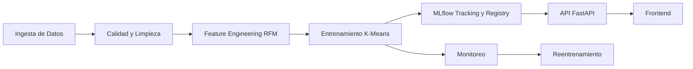

# **Proyecto Final - MLOps (Clustering de Online Retail)**
## Angélica Mata & Steven Murillo

### **1. Business Problem** 

La presente hace referencia a una empresa con sede registrada en el Reino Unido, la cual realiza ventas al por menor en línea y no cuenta con una tienda física. En este sentido, el proyecto tiene por objetivo principal la construcción de una estrategia de segmentación de la clientela de la empresa basada particularmente en el comportamiento de compra de la misma. La segmentación se realiza a partir del modelado no supervisado de Machine Learning, Clustering. A partir de este proceso se busca proporcionar información valiosa para facilitar acciones comerciales específicas de la empresa como el desarrollo e implementación de estrategias de retención de la clientela así como una mejora en la personalización de las campañas de marketing.

### **2. Dataset**

El dataset utilizado se titula Online Retail y se trata de un conjunto de datos de carácter transaccional. Este almacena todas las transacciones realizadas por la empresa dentro del periodo comprendido entre el 1 de diciembre de 2010 y el 9 de diciembre de 2011. El dataset se compone a partir de 541,909 registros y ocho variables diferentes (InvoiceNo, StockCode, Description, Quantity, InvoiceDate, UnitPrice, CustomerID y Country), de las cuales cinco se identifican como categóricas, mientras que las tres restantes representan variables únicas de tipo continua, numérica entera (integer) y fecha. 

| Variable | Descripción |
| --- | --- |
| InvoiceNo | Número de Factura (Si contiene "c" significa que fue cancelada) |
| StockCode |  Código del producto |
| Description | Nombre del Producto |
| Quantity | Cantidad adquirida del producto por cada transacción |
| InvoiceDate | Fecha y hora en las cuales se realizó la transacción |
| IUnitPrice | Precio del producto por unidad (libra estrelina) |
| CustomerID | Identificación del cliente |
| Country | País de residencia de cada cliente |

### ***Conclusiones de la Exploración Inicial*** 

Se presentan valores nulos en las columnas correspondientes a las variables CustomerID y Description lo cual representa una problematica de interes de cara al objetivo del proyecto. Asimismo se presentan valores negativos en la columnas correspondientes a las variables Quantity y Unit Price, punto que resulta inconsistente con la naturaleza que caracteriza los procesos de venta. 

### **3. Architecture**

A continuación se logra visualizar la estructuración de la arquitectura del proyecto, destacando los puntos de mayor relevancia.

### **4. Repository Structure**

En cuanto a la estructura del repositorio, resulta importante destacar la organización del mismo: 
 

- ***data:*** Contiene tanto los datos crudos (raw), como los datos tras ser procesados (processed).
- ***models:*** Almacena el modelo y escalador una vez ya entrenados. Esos se generan al ejecutar "train.py".
- ***notebooks:*** Contienen una realización preliminar de la ingesta de datos, calidad de los datos, Data Quality Gates, análisis exploratorio y feature engineering para facilidad de visualización y experimentación.
- ***src:*** Corresponde al código fuente del proyecto al tiempo que se subdivide en módulos funcionales:
    - ***api:*** FastAPI para servir el modelo. 
    - ***data_quality***: Scripts de limpieza y validación de calidad de los datos. 
    - ***engineer_features***: Construcción de features RFM. 
    - ***Entrenamiento***: Script principal de entrenamiento del modelo ("train.py").
    - ***ingestion***: Ingesta de datos desde la UCI y guardar en formato CSV.
    - ***monitoring***: Script de monitoreo.
- ***requirements.txt***: Dependencias del proyecto.

### **5. Installation**
En aras de ejecutar correctamente el proyecto, favor seguir los siguientes pasos: 
1. **Clonar el repositorio**: 
2. **Activar un entorno virtual:**
3. **Instalar las dependencias:**

### **6. Data Ingestion**

La ingesta de los datos se realiza mediante el script identificado como Ingesta.py (src/ingestion/Ingesta.py), el cual carga el dataset de manera local en caso de ya contar con el mismo. En caso de no contar con el dataset de manera local, el script descarga el dataset Online Retail desde el repositorio oficial de la UCI utilizando ucimlrepo y posteriormente lo almacena localmente en formato CSV. Una vez finalizada la ingesta de los datos, se procede con un análisis exploratorio de los mismos para verificar su calidad y  requerimientos de limpieza. Lo anterior para garantizar que la información utilizada en el modelado sea apropiada para su utilización posterior eficiente. Este proceso se implementa en los scripts de quality2.py (src/data_quality/quality2.py) y gates.py (src/data_quality/gates.py). Posteriormente se procede con la etapa de features engineering. En esta etapa se construye features RFM, las cuales incluyen variables clave como recencia, frecuencia, monetario, cantidad media, cantidad total comprada y precio unitario promedio. 

### **7. Training**

En referencia al proceso de entrenamiento del modelo de segmentación se realiza mediante train.py (src/entrenamiento/train.py), el cual integra todas las etapas previamente mencionadas de manera secuencial como parte del pipeline, preparando los datos y construyendo el modelo. Una vez completadas las etapas de ingesta, calidad y limpieza y feature engineering, se procede con el entrenamiento del modelo. El script ejecuta las siguientes tareas de manera secuencial: 

- ***Preparación de los datos para el Clustering:*** A partir de la matriz RFM, se seleccionan las variables (recency, frequency, monetary, qty_media, qty_total_comprada, unitprice_medio). Sobre este conjunto, se aplica una transformación logarítmica (np.log1p) para mitigar el impacto de valores extremos y, finalmenye un escalado utilizando StandardScaler para estandarizar las magnitudes de las variables.
- ***Entrenamiento del modelo:***

### 8. MLflow 
### 9. Docker 
### 10. API 
### 11. Monitoring 
### 12. Results 
### 13. Team
