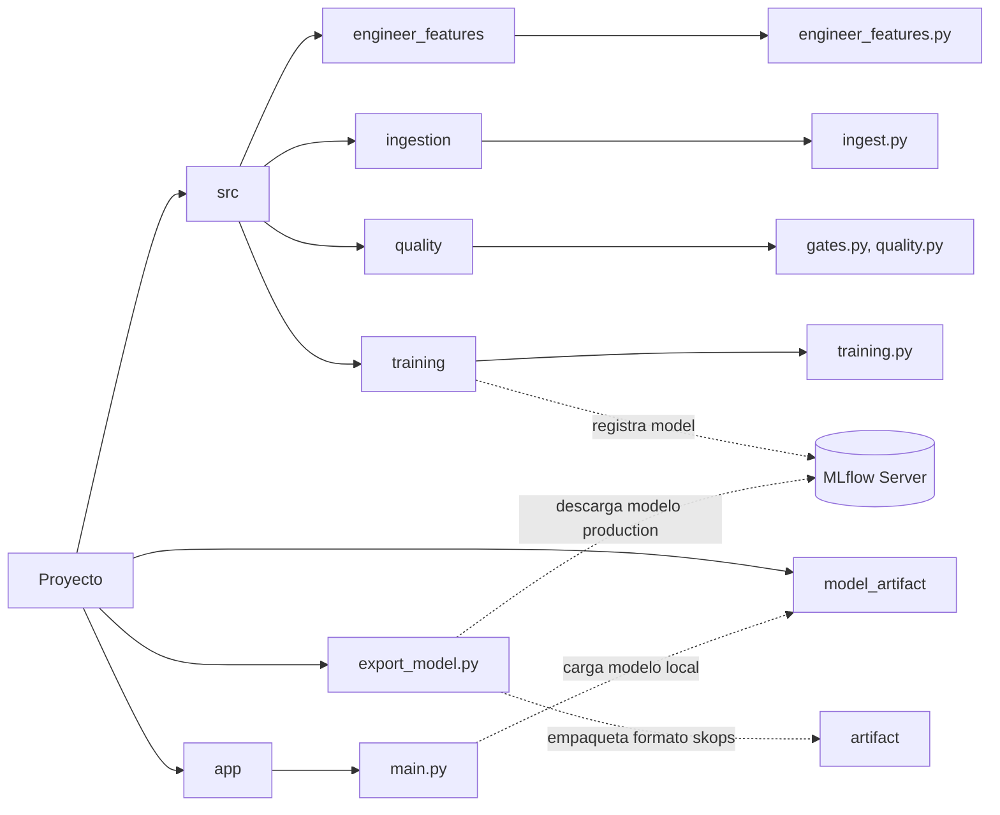

# **Proyecto Final - MLOps (Clustering de Online Retail)**
## Angélica Mata & Steven Murillo

### **1. Business Problem** 

La presente hace referencia a una empresa con sede registrada en el Reino Unido, la cual realiza ventas al por menor en línea y no cuenta con una tienda física. En este sentido, el proyecto tiene por objetivo principal la construcción de una estrategia de segmentación de la clientela de la empresa basada particularmente en el comportamiento de compra de la misma. La segmentación se realiza a partir del modelado no supervisado de Machine Learning, Clustering. A partir de este proceso se busca proporcionar información valiosa para facilitar acciones comerciales específicas de la empresa como el desarrollo e implementación de estrategias de retención de la clientela así como una mejora en la personalización de las campañas de marketing.

### **2. Dataset**

El dataset utilizado se titula Online Retail y se trata de un conjunto de datos de carácter transaccional. Este almacena todas las transacciones realizadas por la empresa dentro del periodo comprendido entre el 1 de diciembre de 2010 y el 9 de diciembre de 2011. El dataset se compone a partir de 541,909 registros y ocho variables diferentes (InvoiceNo, StockCode, Description, Quantity, InvoiceDate, UnitPrice, CustomerID y Country), de las cuales cinco se identifican como categóricas, mientras que las tres restantes representan variables únicas de tipo continua, numérica entera (integer) y fecha. 

| Variable | Descripción |
| --- | --- |
| InvoiceNo | Número de Factura (Si contiene "c" significa que fue cancelada) |
| StockCode |  Código del producto |
| Description | Nombre del Producto |
| Quantity | Cantidad adquirida del producto por cada transacción |
| InvoiceDate | Fecha y hora en las cuales se realizó la transacción |
| IUnitPrice | Precio del producto por unidad (libra estrelina) |
| CustomerID | Identificación del cliente |
| Country | País de residencia de cada cliente |

### ***Conclusiones de la Exploración Inicial*** 

Se presentan valores nulos en las columnas correspondientes a las variables CustomerID y Description lo cual representa una problematica de interes de cara al objetivo del proyecto. Asimismo se presentan valores negativos en la columnas correspondientes a las variables Quantity y Unit Price, punto que resulta inconsistente con la naturaleza que caracteriza los procesos de venta. 

### **3. Architecture**

A continuación se logra visualizar la estructuración de la arquitectura del proyecto, destacando los puntos de mayor relevancia.

### **4. Repository Structure**

En cuanto a la estructura del repositorio, resulta importante destacar la organización del mismo:

- ***data:*** Contiene tanto los datos crudos (raw), como los datos tras ser procesados (processed).
- ***notebooks:*** Contienen una realización preliminar de la ingesta de datos, calidad de los datos, Data Quality Gates, análisis exploratorio y feature engineering para facilidad de visualización y experimentación.
- ***src:*** Corresponde al código fuente del proyecto al tiempo que se subdivide en módulos funcionales:
    - ***engineer_features:*** Construcción de features RFM.
    - ***ingestion:*** Ingesta de datos desde la UCI y guardado en formato CSV.
    - ***quality:*** Scripts de limpieza y validación de calidad de los datos.
    - ***training:*** Script principal de entrenamiento y comparación de modelos de clustering, con registro de experimentos en MLflow.
- ***app:*** Contiene la API de inferencia (main.py), construida con FastAPI, que sirve el modelo ya entrenado.
- ***export_model.py:*** Script que descarga desde el Registry de MLflow el modelo marcado como versión de producción.
- ***model_artifact:*** Contiene el modelo final exportado en formato .skops, listo para ser cargado por la API.
- ***mlartifacts:*** Artefactos generados automáticamente por el servidor local de MLflow durante el tracking de experimentos.
- ***tests:*** Pruebas unitarias para datos, modelo y API.
- ***index.html:*** Interfaz para consumir la API desde el navegador.
- ***Dockerfile:*** Configuración para contenerización del servicio de inferencia.
- ***requirements.txt / requirements-dev.txt:*** Dependencias del proyecto.

### **5. Installation**
En aras de ejecutar correctamente el proyecto, favor seguir los siguientes pasos: 
1. **Clonar el repositorio**: 
2. **Activar un entorno virtual:**
3. **Instalar las dependencias:**

### **6. Data Ingestion**

La ingesta de los datos se realiza mediante el script identificado como ingest.py (src/ingestion/ingest.py), el cual carga el dataset de manera local en caso de ya contar con el mismo. En caso de no contar con el dataset de manera local, el script descarga el dataset Online Retail desde el repositorio oficial de la UCI utilizando ucimlrepo y posteriormente lo almacena localmente en formato CSV. Una vez finalizada la ingesta de los datos, se procede con un análisis exploratorio de los mismos para verificar su calidad y requerimientos de limpieza. Lo anterior para garantizar que la información utilizada en el modelado sea apropiada para su utilización posterior eficiente. Este proceso se implementa en los scripts de quality.py (src/quality/quality.py) y gates.py (src/quality/gates.py). Posteriormente se procede con la etapa de features engineering. En esta etapa se construye features RFM, las cuales incluyen variables clave como recencia, frecuencia, monetario, cantidad media, cantidad total comprada y precio unitario promedio.

### **7. Training**

El proceso de entrenamiento se realiza mediante el script training.py (src/training/training.py), el cual integra todas las etapas previamente mencionadas de manera secuencial como parte del pipeline, preparando los datos y construyendo el modelo. Una vez completadas las etapas de ingesta, calidad y limpieza y feature engineering, se procede con el entrenamiento del modelo. El script ejecuta las siguientes tareas de manera secuencial:

- ***Conexión al servidor de MLflow***: El script se conecta al servidor local de MLflow (http://127.0.0.1:5000) y establece el experimento "online-retail-mlflow" para organizar todas las ejecuciones.
- ***Entrenamiento de múltiples modelos***: Se ejecutan tres algoritmos de clustering: K-Means (k=4), Clustering Jerárquico (Ward, k=4) y DBSCAN (eps=1.5, min_samples=10). Cada modelo se evalúa mediante calinski_harabasz_score y silhouette_score, lo que permite comparar su rendimiento.
- ***Registro en MLflow***: Para cada modelo, se registran parámetros (algoritmo, features, semilla aleatoria, versión de datos), métricas y artefactos (el pipeline completo, un gráfico PCA 2D de los clusters y un archivo JSON con la configuración del run).

Una vez que uno de los modelos es promovido a la etapa de producción dentro del Registry de MLflow, el script export_model.py se encarga de descargar ese modelo y empaquetarlo de forma autocontenida en la carpeta model_artifact/. Esto permite que la API de inferencia funcione de manera independiente, sin necesidad de mantener una conexión activa al servidor de MLflow'

Una vez entrenados y evaluados, el pipeline completo se guarda en la carpeta models para su posterior utilización en la API y en monitoreo. 

### **8. MLflow**

El seguimiento de los experimentos se realiza por medio de MLflow. Lo anterior se encuentra integrado en el script de training.py (src/training/training.py), como es mencionado supra. Esta integración garantiza la trazabilidad de las ejecuciones. Para cada uno de los tres modelos evaluados (K-Means, Clustering Jerárquico y DBSCAN), el script ejecuta una corrida independiente en MLflow y registra los elementos explicados a continuación:

- **Parámetros**: Algoritmo utilizado, conjunto de features, semilla aleatoria, versión de los datos y número de clientes procesados.
- **Métricas**: calinski_harabasz_score y silhouette_score que permiten evaluar la calidad de la segmentación de cada modelo.
- **Pipeline completo**
- **Gráfico PCA**: Se genera una proyección de los clusters y se guarda como imagen para su visualización.
- **Archivo JSON**: Se almacena un resumen con los parámetros. 

Por otro lado, haciendo alusión al registro de modelos, cada modelo nuevo registrado recibe un número de versión, facilitando el seguimiento de cambios. El modelo marcado como versión de producción es posteriormente exportado mediante export_model.py hacia un archivo autocontenido, que es el que finalmente consume la API.

### **9. Docker** 

En materia de Docker, se puede remitir al archivo Dockerfile ubicado en la raíz del proyecto. En este se utiliza la versión de Python 3.12-slim. En esta misma línea, primero se copia el archivo requirements.txt y se instalan las dependencias, aprovechando el caché de Docker para evitar reinstalaciones innecesarias. Posteriormente se copia el código de la API, así como el modelo y artefactos a la imagen. De igual manera, se copia la carpeta model_artifact/ (generada previamente mediante export_model.py) dentro de la imagen, de forma que el contenedor pueda servir predicciones sin depender de una conexión externa al servidor de MLflow.

***Nota:*** Se incluye una healthcheck en esta sección para la verificación paulatina del estado del servicio.

### **10. API**

La implementación de la API se encuentra centralizada en un único archivo, app/main.py, construido con FastAPI.

- ***Carga del modelo:*** La API no se conecta al servidor de MLflow en tiempo de ejecución. En su lugar, carga directamente el archivo .skops ubicado en model_artifact, utilizando la librería skops.

- ***Esquemas de datos:*** Definidos con Pydantic dentro del mismo archivo. CustomerFeatures especifica las seis características del cliente (recencia, frecuencia, monetario, cantidad media, cantidad total comprada y precio unitario medio), cada una con sus validaciones de rango correspondientes. PredictionResponse define la estructura de la respuesta.
- ***Endpoints:***
    - GET /: Verifica que el servicio esté en línea.
    - GET /health: Verifica que el modelo se haya cargado correctamente.
    - POST /predict: Recibe las características de un cliente, aplica la misma transformación logarítmica utilizada en entrenamiento, y devuelve el cluster asignado.

### ***11. Monitoring***

### ***12.
### 12. Results 
### 13. Team